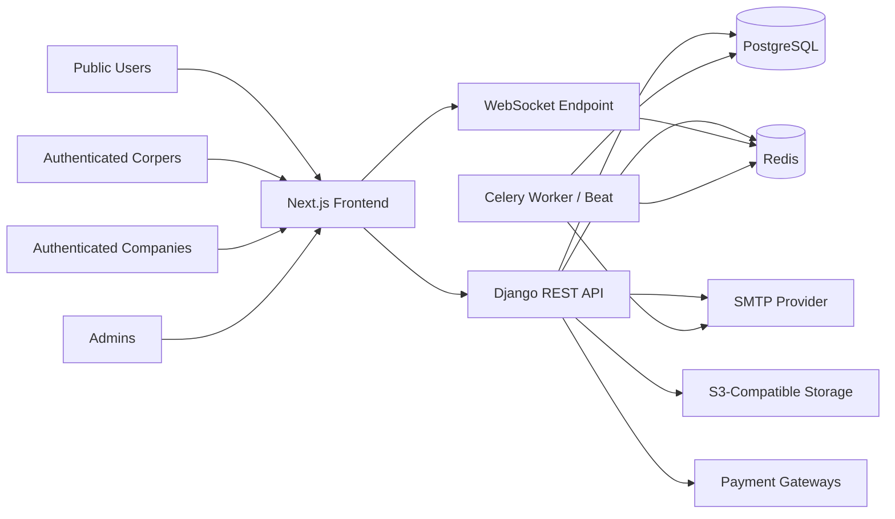
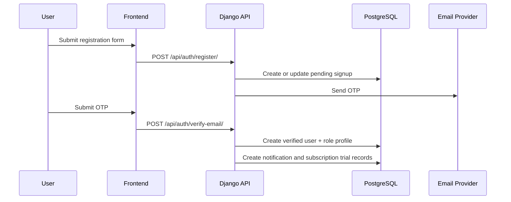

# Solution Architecture Document

## 1. Purpose

This document describes the high-level technical blueprint for Corpershub as currently implemented.

## 2. Architecture Summary

Corpershub is implemented as a modular monolith:

- frontend: Next.js application router app
- backend: Django + Django REST Framework
- realtime: Django Channels over WebSockets
- persistence: PostgreSQL
- async and broker: Redis + Celery
- media: local media in development, S3-compatible storage in production
- deployment packaging: Docker and Docker Compose for local orchestration

## 3. System Context

## 4. Major Components

### 4.1 Frontend

- renders public marketing and role-specific application pages
- manages auth session state in the browser
- calls REST APIs for account, profile, discovery, chat, billing, and admin workflows
- opens WebSocket connections for live chat threads

### 4.2 Backend API

- exposes REST endpoints for all business domains
- applies role-based authorization
- persists domain records
- coordinates audit logging, notifications, and payment flows

### 4.3 Realtime Layer

- authenticates conversation participants
- joins conversation-scoped channel groups
- delivers typing indicators and new messages

### 4.4 Data Layer

- PostgreSQL stores all durable application state
- Redis backs Channels and Celery transport
- object storage holds profile and company images

## 5. Domain Areas

The backend is separated into business-focused apps:

- `accounts`: auth, OTP, account settings, student account lifecycle
- `companies`: company profiles and company directory detail
- `students`: corper profiles and student directory detail
- `search`: discovery, filtering, recommendations, directory stats
- `interests`: interest expression and saved-interest flows
- `chat`: conversations, messages, WebSockets
- `notifications`: in-app notifications
- `verification`: NIN, call-up, and profile review attempts
- `subscriptions`: plan and subscription management
- `payments`: transaction initiation, status, webhook handling
- `adminpanel`: internal admin APIs
- `audit`: audit log persistence

## 6. Frontend / Backend Structure

### 6.1 Frontend Structure

- public routes:
  - home
  - pricing
  - company/corper marketing pages
  - registration and login
  - forgot/reset password
  - billing status
- company routes:
  - dashboard
  - profile
  - settings
  - corper discovery
  - interest lists
  - notifications
  - chat
- student routes:
  - dashboard
  - profile
  - verification
  - settings
  - company discovery
  - interests
  - notifications
  - billing
  - chat
- admin routes:
  - overview
  - users
  - companies
  - student profiles
  - verification lists
  - subscriptions
  - payments
  - audit
  - configuration

### 6.2 Backend Structure

- Django project package: `Corpershub`
- API modules grouped by business capability
- OpenAPI docs exposed through drf-spectacular

## 7. Data Flow Overview

### 7.1 Registration Flow

### 7.2 Discovery and Matching Flow

- frontend sends search/filter query
- backend filters the relevant profile queryset
- backend attaches recommendation metadata where permitted
- backend returns paginated results plus directory stats

### 7.3 Chat Flow

- company initiates conversation via REST
- backend creates or reuses a conversation
- frontend opens conversation thread
- message creation uses REST persistence
- websocket group broadcast delivers live updates

### 7.4 Payment Flow

- frontend requests payment initiation
- backend creates pending subscription and transaction
- backend returns hosted checkout data
- user completes provider checkout
- frontend polls status or webhook updates transaction
- backend activates subscription on successful confirmation

## 8. Third-Party Integrations

- SMTP for OTP and password reset email delivery
- Flutterwave for the active payment flow
- S3-compatible object storage for media
- Redis for realtime and worker transport

## 9. Deployment Model

### 9.1 Local Development

Docker Compose provisions:

- PostgreSQL
- Redis
- MinIO
- backend API
- Celery worker
- Celery beat
- frontend dev server

### 9.2 Production Intent

A production deployment should separate:

- frontend web tier
- backend ASGI/API tier
- Celery worker tier
- Celery beat tier
- PostgreSQL managed database
- Redis managed cache/broker
- object storage
- TLS termination / reverse proxy

## 10. Security Zones

### Zone 1: Public Edge

- web browser
- TLS termination
- public frontend assets

### Zone 2: Application Tier

- Next.js app
- Django API and ASGI endpoints
- auth, business logic, websocket authorization

### Zone 3: Internal Services

- PostgreSQL
- Redis
- Celery workers
- storage credentials
- email and payment secrets

## 11. Scaling Approach

- scale frontend horizontally behind a reverse proxy or platform router
- scale backend ASGI workers horizontally for API and websocket traffic
- scale Celery workers independently from API servers
- scale Redis and PostgreSQL vertically first, then move to managed clustered offerings if needed

## 12. Availability Design

- durable data resides in PostgreSQL
- message state and audit trails remain durable across app restarts
- Redis supports transient realtime coordination
- webhook event persistence improves payment reconciliation reliability
- ASGI-based deployment allows HTTP and websocket traffic through a shared application entrypoint

## 13. Current Solution Notes

- companies no longer rely on an active dashboard billing page
- companies can initiate chat without prior corper interest
- student billing and reactivation remain active solution paths
- some shared billing code still supports company plans, so operational policy should keep code and business rules aligned

## 14. Summary

Corpershub’s solution architecture is a pragmatic web-platform design: a Next.js frontend on top of a Django modular monolith, backed by PostgreSQL, Redis, Channels, and payment/storage integrations. It is cloud-deployable, operationally coherent, and well suited to the current marketplace scope.
